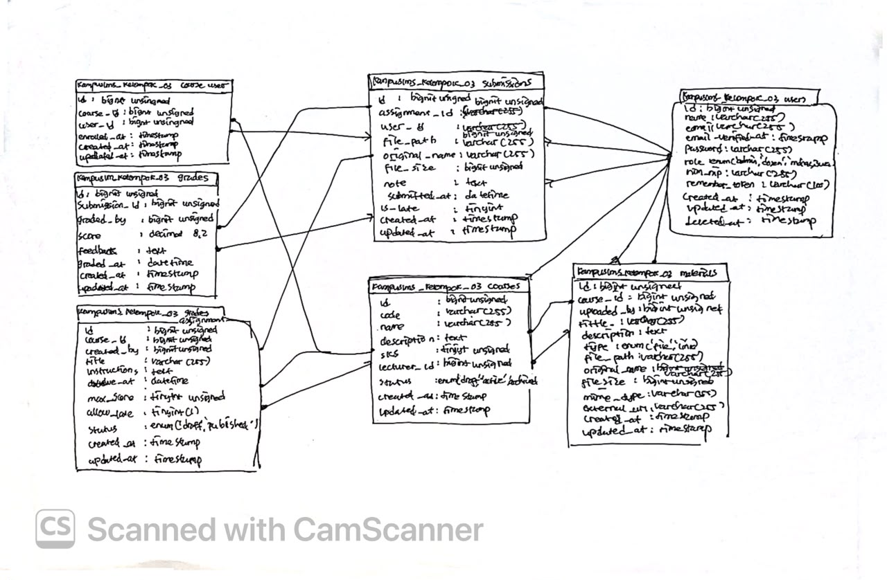

# Week 1

**Mata Kuliah: Pemrograman Web**\
**Pertemuan: 3**\
**Tanggal: 14 September 2026**\
**Topik: Database dan CRUD**\

---

## Ringkasan

### Migrasi: riwayat versi untuk struktur database
Migrasi adalah kode yang mendeskripsikan perubahan struktur database yang menjadi solusi permaslaahan isi database yang tidak sama dalam satu proyek yang sama. Dengan migrasi, struktur database ikut ke repository. Sehingga anggota lain hanya perlu menjalankan `php artisan migrate:fresh --seed` dan akan mendapatkan database yang sama persis satu sama lain.

Dalam migration sendiri memiliki yang namanya `up()` dan `down()`, yang dimana isi `up()` dan isi `down()` saling berlawanan. Misalnya jikalau `up()` adalah membuat tabel, maka isi `down()` adalah menghapus tabel. Jika salah satu tidak memiliki isi, migrasi tesebut akan dianggap sebagai migrasi rusa dan akan ketahuan saat CI menjalankan `migrate:refresh`

### Foreign key dan perilaku penghapusan
| Perilaku | Artinya | Kapan dipakai di KampusLMS |
|------|-----|-------|
| `cascadeOnDelete()` | Penghapusan berantai | Mata kuliah dihapus → materi & tugasnya ikut. Memang tidak berguna lagi. |
| `restrictOnDelete()` | 	Tolak penghapusan selama masih ada anak | Dosen tidak boleh dihapus selama masih mengampu mata kuliah. |
| `nullOnDelete()` | Hapus induk → kolom anak jadi NULL | Jarang dipakai di proyek ini. |

### Unique composite: aturan bisnis yang ditegakkan database
```php
$table->unique(['course_id', 'user_id']);        // di course_user
$table->unique(['assignment_id', 'user_id']);    // di submissions
```
Yang pertama mencegah biar mahasiswa nggak terdaftar 2 kali dalam matkul yang sama, yang kedua agar mencegah satu mahasiswa mengirimkan 2 pengumpulan tugas yang sama

Aplikasi untuk pesan error, database untuk jaminan

### Eloquent dan relasi
`$fillable` dan mass assignment
```php
Course::create($request->all());
```
`$request->all()` berisi semua yang user kirim termasuk `field` yang tidak ada di formulir Anda. Kalau model `User` punya kolom role dan `$fillable`-nya longgar, seorang mahasiswa bisa menambahkan role=admin ke request pendaftaran, dan ia menjadi admin.

Pertahanannya:

* `$fillable` hanya berisi kolom yang memang boleh diisi user. Kolom seperti `role`, `is_verified`, `lecturer_id` sebaiknya tidak dimasukkan di `$fillable`, atau diisi eksplisit di controller.

* Jangan pakai `$request->all()`. Gunakan `$request->validated()` atau `$request->only([...])`.

* Jangan pernah memakai `protected $guarded = [];` itu mematikan perlindungan sepenuhnya.

### Casting di Laravel 12

Di Laravel 11+, casting ditulis sebagai method, bukan properti
```php
protected function casts(): array
{
    return [
        'due_at' => 'datetime',
        'password' => 'hashed',
    ];
}
```
Kalau masih menggunakan `protected $casts = [...]` sebagai properti, berarti masih pakai gaya Laravel 10. Masih bisa jalan, tapi bukan konvensi Laravel 12.

### Factory dan Seeder
Factory adalah pabrik data dummy; seeder yang menjalankan factory.

Contoh : 
```php
// database/factories/CourseFactory.php
public function definition(): array
{
    return [
        'code' => 'SI' . fake()->unique()->numerify('#######'),
        'name' => fake()->randomElement(['Basis Data', 'Pemrograman Web', 'Jaringan Komputer']),
        'sks' => fake()->numberBetween(2, 4),
        'status' => 'active',
    ];
}
```
---
## READ
1. Gambar ulang ERD dari spesifikasi di papan/kertas, tanpa melihat dokumen.

<p align="center">
  
  <br>
  <b>Gambar 1 : ERD Database</b>
</p>

2. Untuk setiap foreign key, tentukan perilaku onDelete-nya dan tuliskan alasannya.

   1. `courses.lecturer_id`
    ```php
    $table->foreignId('lecturer_id')
        ->constrained('users')
        ->restrictOnDelete();
    ```
    Dari kode ini kita bisa tau kalau data dosen tidak bisa di hapus kalau masih digunakan oleh course.

    Kenapa pakai `restrictOnDelete()` ? agar course tidak kehilangan dosen yang menjadi referensinya

   2. `materials.course_id`
    ```php
    $table->foreignId('course_id')
        ->constrained('courses')
        ->cascadeOnDelete();
    ```
    Dari kode ini kita bisa tau kalau course dihapus, semua material yang course punya akan ikut terhapus

    Kenapa pakai `cascadeOnDelete()` ? karna material bergantung pada course, kalau course tidak ada material tidak lagi punya konteks yang dibutuhkan

   3. `materials.uploaded_by`
    ```php
    $table->foreignId('uploaded_by')
        ->constrained('users');
    ```
    Kenapa nggak ada `restrictOnDelete()` dan `cascadeOnDelete()` karena perilaku `onDelete` tidak ditentutkan secara eksplisit. Yang ditentukan adlaah `upload_by` adalah foreign key yang mengarah ke tabel `users`

   4. `assignments.course_id`
    ```php
    $table->foreignId('course_id')
        ->constrained('courses')
        ->cascadeOnDelete();
    ```
    Dari kode ini kita bisa tau kalau course dihapus, semua assignment/tugas yang terkait dengan course itu ikut kehapus

    Kenapa begitu ? karna assignment adalah data yang bergantung pada course, kalau course tidak ada tugasnya juga tidak diperlukan lagi

   5. `assignments.created_by`
    ```php
    $table->foreignId('created_by')
        ->constrained('users');
    ```
    Kenapa nggak ada `restrictOnDelete()` dan `cascadeOnDelete()` karena perilaku `onDelete` tidak ditentutkan secara eksplisit.

    Jadi `created_by` dipakai untuk nyimpan user yang buat assignment

   6. `submissions.assignment_id`
    ```php
    $table->foreignId('assignment_id')
        ->constrained('assignments')
        ->cascadeOnDelete();
    ```
    Dari kode ini kita tau kalau sebuah asignment/tugas dihapus, semua submission yang terkait dengan tugas itu juga ikut dihapus.

    Kenapa begitu ? karna submission tergantung pada assignment, kalau tugasnya sudah tidak ada submission juga tidak memiliki induk lagi

   7. `submissions.user_id`
    ```php
    $table->foreignId('user_id')
        ->constrained('users');
    ```
    Kenapa nggak ada `restrictOnDelete()` dan `cascadeOnDelete()` karena perilaku `onDelete` tidak ditentutkan secara eksplisit.

   8. `grades.submission_id`
    ```php
    $table->foreignId('submission_id')
        ->unique()
        ->constrained('submissions')
        ->cascadeOnDelete();
    ```
   * `constrained('submissions')` menghubungkan `submission_id` ke `submissions.id`.
   * `cascadeOnDelete()` kalau submission dihapus, grade-nya ikut dihapus.

   9. `grades.graded_by`
    ```php
    $table->foreignId('graded_by')
        ->constrained('users');
    ```
    `graded_by` menyiman user yang memberikan nilai pada submission dan tidak ada `onDelete` yang ditulis secara eksplisit.

   10.  `course_user.course_id`
    ```php
    $table->foreignId('course_id')
        ->constrained('courses')
        ->cascadeOnDelete();
    ```
    Dari kode ini kita tau kalau `course_id` menghubungkan `course_user` dengan `courses.id`. `course_user` itu tabel penghubung mahasiswa dengan mata kuliah.

   11.  `course_user.user_id`
    ```php
    $table->foreignId('user_id')
        ->constrained('users')
        ->cascadeOnDelete();
    ```
    Dari kode ini kita tau kalau `user_id` menghubungkan `course_user` dengan `users.id`. Karna data di `course_user` hanya nunjukkin hubungan user sama mata kuliah. Kalau user sudah tidak ada, hubungan itu tidak di perlukan

3. Jawab: kalau seorang dosen dihapus, apa yang terjadi pada mata kuliahnya? Kenapa dirancang begitu?
Kalau dosen dalam status mengajar suatu matkul, database bakal menolak untuk menghapus karena masih ada course yang manggil `lecture_id` dosen.

4. Jawab: kenapa grades.submission_id bersifat unique, bukan sekadar index biasa?
Agar satu submission hanya bisa di miliki satu data grade


5. sesuai dengan gambar


bisa dilihat bahwa hasil dari `php artisan route:list --path=tentang` sama seperti yang saya telah tulis di nomor 1


---

## Break

1. Prediksi awal : Mahasiswa yang sama akan terdaftar 2 kali dalam satu matakuliah yang sama

Hasil : Data ganda berhasil masuk karena database tidak lagi mencegah kombinasi `course_id` dan `user_id` yang sama.

2. Prediksi awal : User yang awalnya role selain admin, berubah menjadi role admin dan mendapatkan akses yang hanya role admin dapatkan.

Hasil : User berhasil dibuat sebagai admin meskipun `role` tidak berasal dari field formulir.

3. Prediksi awal : Field yang bisa diisi user tidak terkontrol sehingga user bisa mengubah data yang bersifat private/khusus misalnya role, jadi user bisa mengisi rolenya sendiri lewat field.

Hasil : Field role dapat diisi melalui mass assignment karena tidak ada atribut yang dilindungi.

4. Prediksi awal : Jika posisi ada tabel dan data di tabel dalam database, tabel dan data tersebut tidak terefresh namun sistem tetap menganggap berhasil dan terjadilah migration reversible.

Hasil : Migration tidak dapat membalik perubahan `up()` dengan benar sehingga migration menjadi tidak reversible.

5. Prediksi awal : Saat hendak menghapus satu dosen apalagi dosen tersebut masih mengajar suatu mata kuliah/course, yang kehapus bukan hanya dosen namun course ataupun data yang masih berhubungan dengan dosen tersebut.

Hasil : `restrictOnDelete` diubah menjadi `cascadeOnDelete`, lalu dosen dihapus. Course yang menggunakan dosen tersebut ikut terhapus sehingga terjadi kehilangan data berantai.